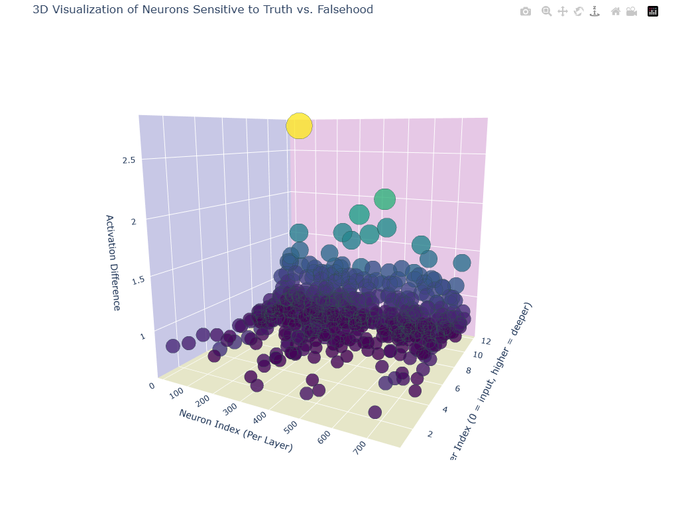

# **Latent Knowledge Analysis in GPT-2 (Paper Replication)**

### **Mechanistic Interpretability Hackathon Submission**

**Author:** Letlotlo Mokuoa  
**Date:** 9 March 2025  

---

## **Project Overview**

This repository contains a **replication of Burns et al.'s 2022 paper**, *"Discovering Latent Knowledge in Language Models Without Supervision"*.  
Our goal was to **reproduce and understand their core finding**: that factual knowledge in large language models (like GPT-2) is **stored in a distributed and latent way**, not in specific neurons or layers.

We conducted a series of careful experiments to explore this in GPT-2.

---

## **Key Takeaways from Replication**

- ✅ **Factual knowledge appears distributed** — no single neuron, layer, or attention head controls factual recall.
- ✅ **Intervening on neurons, layers, and heads** (zeroing out, amplifying, adding noise) did **not disrupt factual outputs**, confirming robustness.
- ✅ A **3D visualization** of top fact-sensitive neurons shows that **neurons across many layers are involved in storing factual knowledge**, supporting Burns et al.'s hypothesis.

---

## **Files and What They Do**

| Python File                          | Purpose                                                   |
|--------------------------------------|-----------------------------------------------------------|
| `activation_probing.py`               | Analyze activation differences in neurons (probing for fact sensitivity). |
| `attention_tracing.py`                | Modify attention heads to assess their role in factual recall. |
| `causal_tracing.py`                   | Basic causal tracing and activation interventions.         |
| `causal_tracing_expanded.py`          | Expanded neuron-level interventions to amplify or zero neurons. |
| `causal_tracing_deep.py`              | Multi-neuron and multi-layer interventions to disrupt factual recall. |
| `causal_tracing_layer.py`             | Overwrite entire layer activations (zero and noise) to observe model robustness. |
| `neuron_analysis.py`                  | Analyze and identify neurons that respond to truth vs. falsehood. |
| `latent_knowledge_distribution.py`   | **Final visualization**: 3D scatter plot of top neurons involved in factual knowledge. |

---

## **Final Visualization Example**

> **3D scatter plot** highlighting the top 5% of neurons most sensitive to factual correctness, distributed across GPT-2’s layers.




---

## **Conclusion of the Replication**

> Our experiments **replicate Burns et al.'s finding** that factual knowledge in GPT-2 is **latent, distributed, and stored in superposition**.  
> No isolated \"fact neuron\" was found, and modifying small components was insufficient to alter factual recall.  
> This supports the view that **mechanistic interpretability must address distributed representations**.

---

## **Reference (Replicated Paper)**

> Burns, C., Ye, H., Klein, D., & Steinhardt, J. (2022). *Discovering Latent Knowledge in Language Models Without Supervision*. arXiv preprint arXiv:2212.03827.  
> [https://arxiv.org/abs/2212.03827](https://arxiv.org/abs/2212.03827)

---

## **How to Run (for Visualization)**

```bash
pip install torch transformers matplotlib plotly
python latent_knowledge_distribution.py
