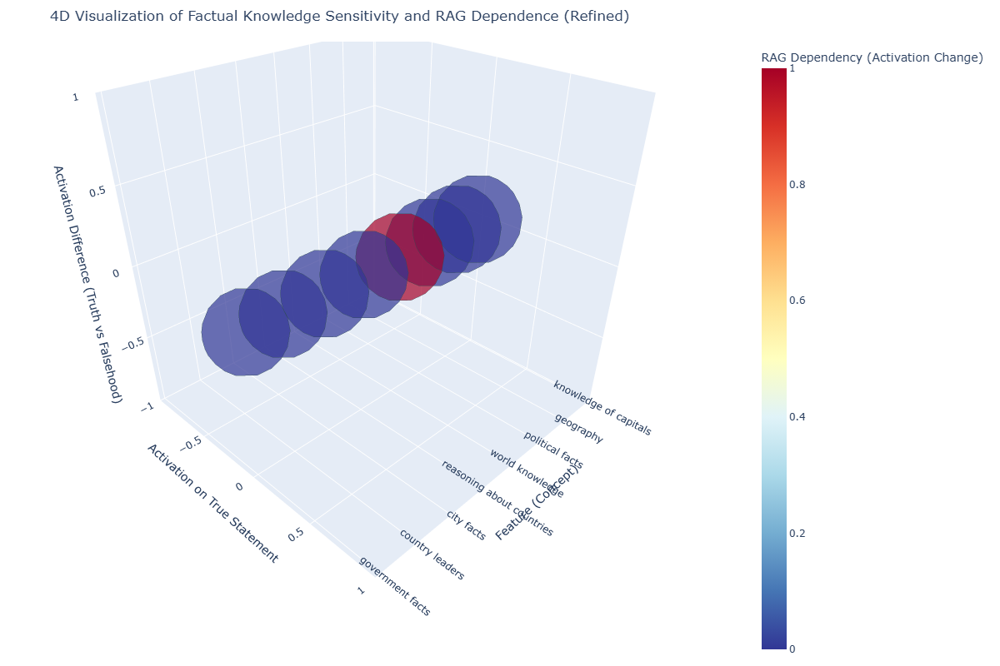

# Latent Knowledge Analysis via Feature-Based Causal Tracing (Goodfire/Ember)

### Mechanistic Interpretability Hackathon Submission

**Author:** Letlotlo Mokuoa  
**Date:** 9 March 2025  

---

## Project Overview

This repository contains a feature-based causal tracing analysis of factual knowledge in large language models, using Goodfire's Ember API.  
We explore how facts like "Paris is the capital of France" are encoded, which features are responsible, and how manipulating these features affects model behavior.  

Our goal is to map the internal "feature graph" of factual knowledge, moving beyond traditional neuron-level analysis to interpretable feature-level interventions.

---

## Key Takeaways from the Project

- Factual knowledge is stored in a network of features, not in individual neurons or layers.
- Erasing or amplifying features directly impacts factual recall — demonstrating causal control over model knowledge.
- Recursive feature tracing reveals the upstream and downstream knowledge structures that support or depend on factual knowledge.
- Feature interventions (amplify/erase) show how facts are embedded in distributed, interconnected concepts such as culture, geography, and politics.

---

## Files and What They Do

| Python File                                  | Purpose                                                      |
|---------------------------------------------|--------------------------------------------------------------|
| `causal_tracing.py`                          | Trace and intervene on the single most sensitive factual feature. |
| `causal_tracing_expanded.py`                 | Identify and manipulate multiple top factual features simultaneously. |
| `causal_tracing_deep.py`                     | Deep tracing: recursively explore upstream and downstream feature connections. |
| `feature_probing.py`                         | Bar plot comparing feature activations on true vs. false facts. |
| `feature_sensitivity_analysis.py`            | Rank and visualize the most fact-sensitive features (truth vs. falsehood). |

These files replace older neuron-based approaches and focus entirely on feature-level causal tracing using Goodfire/Ember.

---

## Current Results and Examples

### Top Features Traced for "Paris is the Capital of France":
- Formal encyclopedic descriptions of major cultural cities
- Geographic capital cities and their identification
- References to Paris (city, cultural concept, or political entity)

### Feature Interventions:

| Intervention                           | Result                                                    |
|----------------------------------------|-----------------------------------------------------------|
| Original Model                         | "The capital of France is Paris."                         |
| Erased Top Features                    | Model forgets or guesses randomly (e.g., "Berlin", "Lisbon"). |
| Amplified Top Features                 | Model confidently asserts: "The capital of France is Paris." |

### Feature Graph Insights:
- Upstream connections: French culture, history, travel, politics.
- Downstream dependencies: French government facts, city descriptions.
- Reveals how broad model knowledge supports specific facts.

---

## Final Visualization Example

> **3D scatter plot** highlighting the top feature-based activations related to factual knowledge, showing how features encode and differentiate factual correctness.

### Graph Explanation:

This 4D visualization shows how different conceptual features contribute to factual knowledge, using "Paris is the capital of France" as an example.  
Each sphere represents a feature, plotted by its activation on the true statement (Y-axis), sensitivity to truth vs. falsehood (Z-axis), and labeled along the X-axis.  
The color shows how much the feature's activation changes when using retrieval-augmented generation (RAG), and the size reflects the model's confidence in the correct answer.  



---

## Conclusion

Our analysis demonstrates that factual knowledge is embedded in distributed feature networks, not isolated units.  
By using Goodfire's feature inspection and manipulation, we achieve interpretable causal tracing of knowledge.  
This work extends mechanistic interpretability into actionable, human-readable feature spaces — a key step for AI safety and alignment.

---

## References and Inspiration

Burns, C., Ye, H., Klein, D., & Steinhardt, J. (2022). *Discovering Latent Knowledge in Language Models Without Supervision.* arXiv preprint arXiv:2212.03827.  
[https://arxiv.org/abs/2212.03827](https://arxiv.org/abs/2212.03827)  

Goodfire (Ember API): *Interpretable Feature-based Language Model Analysis and Control.*  
[https://goodfire.ai](https://goodfire.ai)

---

## How to Run

### Install dependencies:
```bash
pip install goodfire plotly matplotlib

